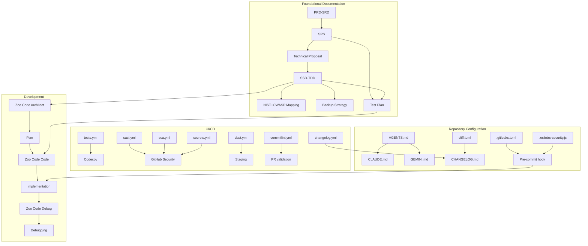

# Workflow Architecture

🌍 **Read this in:** [Español](../es/ARQUITECTURA.md) | [English](ARCHITECTURE.md)

> This document explains **why** the workflow is designed this way, not just **what** it does.

---

## Design principles

### 1. Documentation before code

The workflow forces the 7 foundational documents to be generated and validated **before** writing a single line of code. This avoids the classic problem of "start coding and document later", which produces outdated and contradictory documentation.

**Practical consequence:** The AI is not allowed to generate code until `docs/Test_Plan.md` is approved.

### 2. Sequential workflow with human validation

Each document depends on the previous one. The SRS cannot be generated without the PRD-SRD, nor the SSD-TDD without the SRS and the Technical Proposal. Between each document, **you validate and approve**.

**Practical consequence:** If a document does not convince you, you iterate on that document before moving forward. Errors do not accumulate.

### 3. One prompt = one document

Each prompt generates **a single document**. There are no monolithic prompts that generate 7 documents at once.

**Practical consequence:** Fewer hallucinations, more control over the output, better quality per document.

### 4. Automated security from the first commit

Security workflows (SAST, SCA, secrets, DAST) are present from day 1, not added at the end.

**Practical consequence:** Every PR goes through 5 security checks before merging.

### 5. AI agents with persistent context

The `AGENTS.md` file (and its bridges `CLAUDE.md` and `GEMINI.md`) ensure that any AI working on the repo reads the documentation, the forensic record, and the changelog before touching code.

**Practical consequence:** The AI does not operate "blindly". It always has the project context.

### 6. Continuity through the Forensic Record

For projects without documentation (your own or third-party), there is `docs/FORENSIC_RECORD.md`, which records the result of the reverse engineering performed by the AI.

**Practical consequence:** Future AI sessions read that record and do not re-discover what has already been analyzed.

---

## Component diagram

---

## Design decisions and trade-offs

| Decision | Discarded alternative | Why this one was chosen |
|----------|----------------------|-------------------------|
| Zoo Code over Cline | Cline (more stable) | Zoo Code has modes (Architect, Code, Debug) that Cline does not have |
| DeepSeek V4 Flash as the workhorse | Claude Sonnet for everything | 10-100x lower cost, sufficient quality for code |
| Workflows split by domain | A single monolithic workflow | If one step fails, it does not stop the others |
| MIT License | Apache 2.0 or GPL | Maximum adoption, no restrictions for proprietary use |
| Codecov with PR blocking | Informational only | Ensures new code has minimum coverage |
| `FORENSIC_RECORD.md` in docs/ | External log | The AI can read it if it is in the repo |
