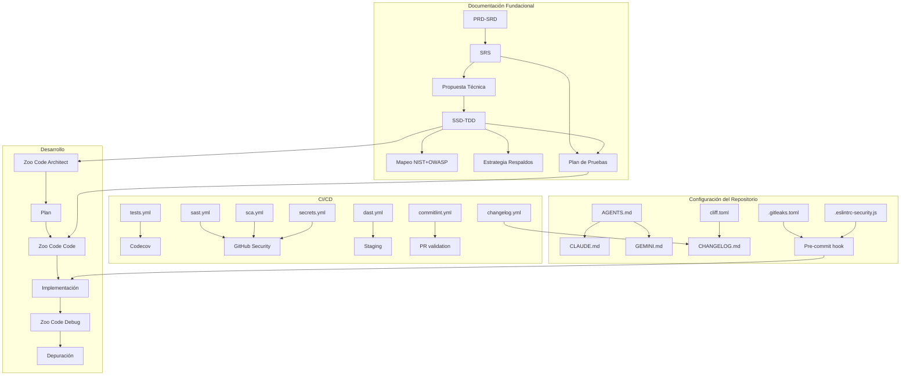

# Arquitectura del Flujo de Trabajo

🌍 **Lee esto en:** [Español](ARQUITECTURA.md) | [English](../en/ARCHITECTURE.md)

> Este documento explica **por qué** el flujo está diseñado así, no solo **qué** hace.

---

## Principios de diseño

### 1. Documentación antes que código

El flujo fuerza que los 7 documentos fundacionales se generen y validen **antes** de escribir una sola línea de código. Esto evita el problema clásico de "empezar a programar y documentar después", que produce documentación desactualizada y contradictoria.

**Consecuencia práctica:** La IA no recibe permiso para generar código hasta que `docs/Plan_Pruebas.md` está aprobado.

### 2. Secuencialidad con validación humana

Cada documento depende del anterior. No se puede generar el SRS sin el PRD-SRD, ni el SSD-TDD sin el SRS y la Propuesta Técnica. Entre cada documento, **tú validas y apruebas**.

**Consecuencia práctica:** Si un documento no te convence, iteras sobre ese documento antes de avanzar. No se acumulan errores.

### 3. Un prompt = un documento

Cada prompt genera **un solo documento**. No hay prompts monolíticos que generen 7 documentos de golpe.

**Consecuencia práctica:** Menos alucinaciones, más control sobre el output, mejor calidad por documento.

### 4. Seguridad automatizada desde el primer commit

Los workflows de seguridad (SAST, SCA, secrets, DAST) están presentes desde el día 1, no se añaden al final.

**Consecuencia práctica:** Cada PR pasa por 5 validaciones de seguridad antes de mergear.

### 5. Agentes de IA con contexto persistente

El archivo `AGENTS.md` (y sus puentes `CLAUDE.md` y `GEMINI.md`) garantizan que cualquier IA que trabaje en el repo lea la documentación, el registro forense y el changelog antes de tocar código.

**Consecuencia práctica:** La IA no opera "a ciegas". Siempre tiene el contexto del proyecto.

### 6. Continuidad mediante Registro Forense

Para proyectos sin documentación (tuyos o de terceros), existe `docs/REGISTRO_FORENSE.md`, que registra el resultado de la ingeniería inversa realizada por la IA.

**Consecuencia práctica:** Futuras sesiones de IA leen ese registro y no re-descubren lo que ya se analizó.

---

## Diagrama de componentes

---

## Decisiones de diseño y trade-offs

| Decisión | Alternativa descartada | Por qué se eligió esta |
|----------|----------------------|------------------------|
| Zoo Code sobre Cline | Cline (más estable) | Zoo Code tiene modos (Architect, Code, Debug) que Cline no tiene |
| DeepSeek V4 Flash como caballo de batalla | Claude Sonnet para todo | Costo 10-100x menor, calidad suficiente para código |
| Workflows divididos por dominio | Un solo workflow monolítico | Si falla un paso, no detiene los demás |
| MIT License | Apache 2.0 o GPL | Máxima adopción, sin restricciones para uso propietario |
| Codecov con bloqueo de PR | Solo informativo | Garantiza que el código nuevo tenga cobertura mínima |
| `REGISTRO_FORENSE.md` en docs/ | Bitácora externa | La IA puede leerlo si está en el repo |
