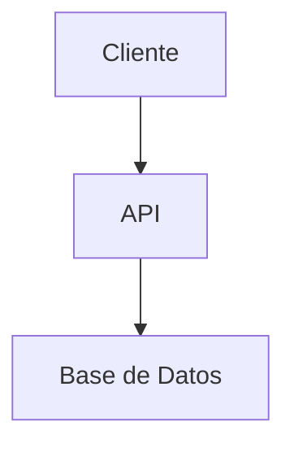

# Propuesta Técnica

> **Estado:** Pendiente de redacción.
> **Instrucciones:** Usar el Prompt 3 (`docs/prompts/03-Propuesta-Tecnica.md`) con DeepSeek web o Gemini web.
> **Depende de:** `docs/SRS.md`
> **Alimenta a:** `docs/SSD-TDD.md`

---

## 1. Stack tecnológico

### 1.1. Lenguaje(s) de programación
- **Lenguaje principal:** [Lenguaje y versión]
- **Justificación:** [Por qué se eligió]
- **Alternativas descartadas:** [Y por qué]

### 1.2. Framework(s) backend
- **Framework:** [Nombre y versión]
- **Justificación:** [Por qué se eligió]

### 1.3. Framework(s) frontend
- **Framework:** [Nombre y versión, si aplica]
- **Justificación:** [Por qué se eligió]

### 1.4. Base de datos
- **Motor:** [PostgreSQL, MySQL, SQLite, etc.]
- **Justificación:** [Por qué se eligió]

### 1.5. Infraestructura
- **Despliegue:** [Local, contenedores, nube]
- **Justificación:** [Por qué se eligió]

## 2. Arquitectura de alto nivel

[Descripción de componentes y flujo de datos.]

## 3. Estrategia de despliegue

### 3.1. Desarrollo
[Pendiente: cómo se despliega en desarrollo.]

### 3.2. Producción
[Pendiente: cómo se despliega en producción.]

### 3.3. Rollback
[Pendiente: cómo revertir un despliegue.]

## 4. Estrategia de licenciamiento

- **Modelo elegido:** [100% free / 100% propietario / community + versión paga]
- **Licencia recomendada:** [MIT, GPL-3.0, Apache 2.0, propietaria]
- **Compatibilidad de dependencias:** [Verificación de licencias]

## 5. Riesgos técnicos y mitigaciones

| ID | Riesgo | Probabilidad | Impacto | Mitigación |
|----|--------|--------------|---------|------------|
| RT-001 | [Riesgo] | [Alta/Media/Baja] | [Alto/Medio/Bajo] | [Mitigación] |
