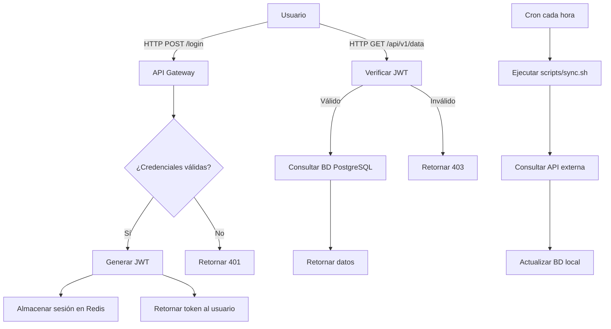
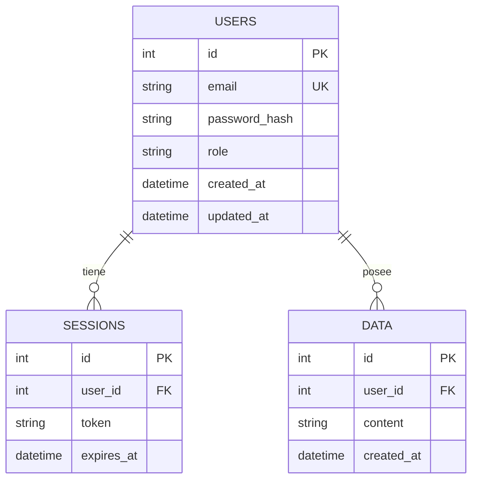

# Registro Forense — [NOMBRE DEL SISTEMA]

> **Propósito:** Este documento registra lo que la IA descubrió al analizar un sistema sin documentación.
> NO es documentación oficial; es el resultado de ingeniería inversa.
> Si algo aquí es incorrecto, corrígelo en una nueva sesión de análisis y actualiza este archivo.
>
> **Uso:** Cualquier IA que trabaje en este repositorio DEBE leer este archivo completo antes de modificar código.
> Si descubre algo nuevo, DEBE añadirlo aquí con fecha y hallazgo.

---

## 1. Metadatos del análisis

| Campo | Valor |
|-------|-------|
| **Fecha del análisis inicial** | [YYYY-MM-DD] |
| **Última actualización** | [YYYY-MM-DD] |
| **Herramienta usada** | Zoo Code (modo Architect) |
| **Modelo usado** | [DeepSeek V4 Flash / Qwen3 Coder Next / otro] |
| **Versión del código analizado** | [commit hash o fecha] |
| **Tipo de sistema** | [web / API / script / escritorio / mixto] |
| **Origen del código** | [propio sin docs / terceros / desconocido] |
| **Licencia detectada** | [MIT / GPL / propietaria / desconocida] |

---

## 2. Inventario de módulos y archivos

> Lista todos los directorios y archivos relevantes. El campo "Confianza" indica qué tan seguro está la IA de su propósito: Alta (verificado), Media (inferido), Baja (especulación).

| Ruta | Tipo | Propósito descubierto | Confianza | Notas |
|------|------|----------------------|-----------|-------|
| `src/` | Directorio | Código fuente principal | Alta | |
| `src/auth/` | Directorio | Gestión de autenticación y sesiones | Alta | Usa JWT |
| `src/models/` | Directorio | Modelos de datos (ORM) | Alta | SQLAlchemy |
| `src/api/` | Directorio | Endpoints REST | Alta | FastAPI |
| `scripts/backup.sh` | Script | Respaldo de BD a las 3 AM | Media | Revisar retención |
| `scripts/deploy.sh` | Script | Despliegue manual a producción | Media | Posible automatizar |
| `config/db.yml` | Config | Configuración de conexión a BD | Alta | ⚠️ Revisar si contiene credenciales |
| `config/app.yml` | Config | Configuración general | Alta | |
| `.env` | Config | Variables de entorno (no commitear) | Alta | Verificar `.gitignore` |
| `tests/` | Directorio | Tests unitarios e integración | Media | Cobertura desconocida |
| `docs/` | Directorio | Documentación existente | Baja | Contenido mínimo |
| `migrations/` | Directorio | Migraciones de base de datos | Alta | Alembic |

---

## 3. Flujo de datos descubierto

> Diagrama del flujo principal del sistema. Usar Mermaid para que VS Code lo renderice.



---

## 4. Puntos de entrada

> Todos los lugares por donde el sistema recibe input del exterior. Son los puntos críticos para seguridad.

| Punto de entrada | Protocolo | Puerto | Autenticación | Notas |
|------------------|-----------|--------|---------------|-------|
| `/api/v1/auth/login` | HTTP | 8000 | No | Recibe usuario/contraseña |
| `/api/v1/auth/register` | HTTP | 8000 | No | Recibe datos de usuario |
| `/api/v1/data/*` | HTTP | 8000 | JWT | Requiere token válido |
| `/api/v1/admin/*` | HTTP | 8000 | JWT + rol admin | Requiere rol elevado |
| `scripts/sync.sh` | Cron | — | — | Se ejecuta cada hora |
| `scripts/backup.sh` | Cron | — | — | Se ejecuta a las 3 AM |
| Base de datos | TCP | 5432 | Usuario/contraseña | Verificar si escucha en 0.0.0.0 |
| Redis | TCP | 6379 | Sin auth (?) | ⚠️ Verificar configuración |

---

## 5. Dependencias externas críticas

> Lista de dependencias que, si fallan o son vulneradas, comprometen el sistema.

| Dependencia | Versión | Tipo | Riesgo detectado | Última verificación |
|-------------|---------|------|------------------|---------------------|
| `fastapi` | 0.115.x | Framework web | Sin CVEs conocidos | [fecha] |
| `sqlalchemy` | 2.0.x | ORM | Sin CVEs conocidos | [fecha] |
| `psycopg2` | 2.9.x | Driver PostgreSQL | Revisar versión | [fecha] |
| `redis-py` | 5.x | Cliente Redis | Sin CVEs conocidos | [fecha] |
| `python-jose` | 3.3.x | JWT | Sin CVEs conocidos | [fecha] |
| `passlib` | 1.7.x | Hash de contraseñas | Sin CVEs conocidos | [fecha] |

**Comando para verificar vulnerabilidades:**
```bash
pip-audit -r requirements.txt
# o
trivy fs --severity CRITICAL,HIGH .
```

---

## 6. Esquema de base de datos descubierto

> Tablas, columnas y relaciones inferidas del código (no del schema oficial, que puede no existir).



**Notas:**
- No se detectaron índices explícitos. Verificar si hay índices en producción.
- No se detectaron foreign keys explícitas. Verificar integridad referencial.

---

## 7. Zonas oscuras (NO entendidas)

> La IA DEBE marcar aquí lo que NO pudo determinar. Futuras sesiones deben resolverlo.

- [ ] `src/legacy/old_parser.py`: no se entiende su función exacta. Parece parsear un formato propietario.
- [ ] `config/.env.example`: variables sin documentar. ¿Qué hace `CUSTOM_API_KEY`?
- [ ] `scripts/cron.sh`: no se sabe si sigue en uso o es legacy.
- [ ] `src/utils/helpers.py`: función `_internal_hash()` no tiene documentación ni tests.
- [ ] `migrations/versions/003_*.py`: migración que elimina una tabla sin backup documentado.

---

## 8. Pendientes de verificación

> Acciones concretas que futuras sesiones deben ejecutar para completar el entendimiento del sistema.

- [ ] Ejecutar `npm audit` / `pip-audit` y registrar hallazgos.
- [ ] Verificar si `scripts/backup.sh` tiene retención configurada.
- [ ] Confirmar si hay endpoints sin autenticación (revisar `src/api/routes/`).
- [ ] Verificar si la BD escucha en `0.0.0.0` o solo en `localhost`.
- [ ] Revisar si hay secretos hardcodeados (ejecutar `gitleaks detect`).
- [ ] Ejecutar `semgrep` con reglas OWASP Top 10.
- [ ] Verificar versión de Python/Node y si está actualizada.
- [ ] Revisar logs para ver si hay errores recurrentes no documentados.

---

## 9. Hallazgos de seguridad preliminares

> Lo que la IA detectó como posible riesgo durante el análisis. No es una auditoría completa; es una primera pasada.

| Hallazgo | Severidad | Ubicación | Acción sugerida |
|----------|-----------|-----------|-----------------|
| Posible secreto hardcodeado | Alta | `config/db.yml` línea 12 | Mover a `.env` |
| Endpoint sin rate limiting | Media | `/api/v1/auth/login` | Añadir middleware |
| Redis sin auth | Alta | `config/app.yml` | Configurar `requirepass` |
| Logs con posible PII | Media | `src/utils/logger.py` | Revisar qué se loguea |
| Dependencia desactualizada | Baja | `requirements.txt` | Actualizar `psycopg2` |

---

## 10. Historial de actualizaciones

| Fecha | Qué se actualizó | Quién | Sesión |
|-------|------------------|-------|--------|
| [YYYY-MM-DD] | Análisis inicial completo | IA + tú | #1 |
| [YYYY-MM-DD] | Resuelta zona oscura `old_parser.py` | IA + tú | #2 |
| [YYYY-MM-DD] | Añadido hallazgo de seguridad en Redis | IA | #3 |

---

## 11. Instrucciones para futuras sesiones de IA

> Esta sección es para que cualquier IA que lea este archivo sepa cómo usarlo.

**Antes de modificar código:**
1. Lee este archivo completo.
2. Si vas a modificar un módulo, busca su entrada en la sección 2 (Inventario).
3. Si el módulo está en "Zonas oscuras" (sección 7), NO lo modifiques sin antes analizarlo y actualizar este archivo.
4. Si descubres algo nuevo, actualiza la sección correspondiente con fecha y hallazgo.
5. Si resuelves un pendiente (sección 8), márcalo como completado.

**Al terminar tu sesión:**
1. Actualiza la sección 10 (Historial) con lo que hiciste.
2. Si añadiste nuevos pendientes, agrégalos a la sección 8.
3. Si encontraste nuevos riesgos, agrégalos a la sección 9.

---