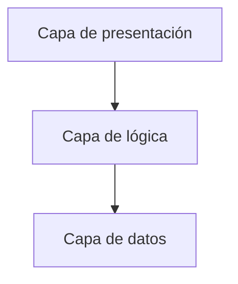
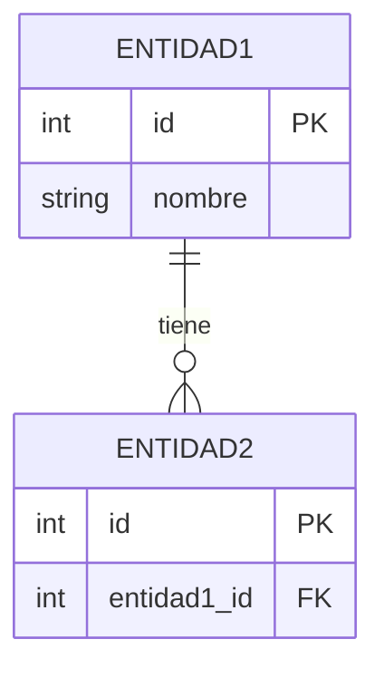
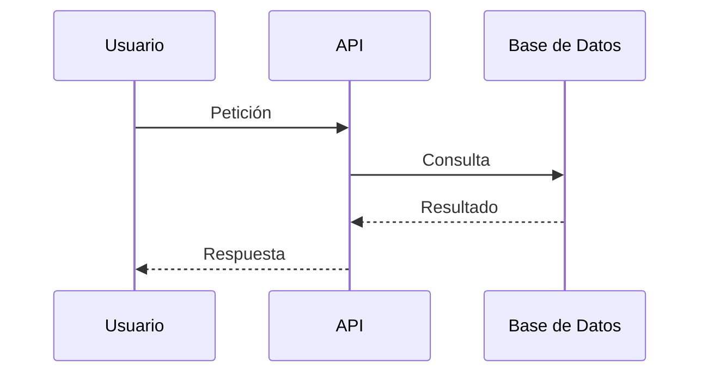

# SSD-TDD — Software Design Document + Technical Design Document

> **Estado:** Pendiente de redacción.
> **Instrucciones:** Usar el Prompt 4 (`docs/prompts/04-SSD-TDD.md`) con DeepSeek web.
> **Depende de:** `docs/SRS.md` + `docs/Propuesta_Tecnica.md`
> **Alimenta a:** `docs/Mapeo_NIST_OWASP.md`, `docs/Estrategia_Respaldos.md`, `docs/Plan_Pruebas.md`

---

## 1. Arquitectura detallada

### 1.1. Diagrama de componentes



### 1.2. Capas de la aplicación
- **Presentación:** [Descripción]
- **Lógica de negocio:** [Descripción]
- **Acceso a datos:** [Descripción]

### 1.3. Patrones de diseño aplicados
| Patrón | Dónde se aplica | Justificación |
|--------|-----------------|---------------|
| [Patrón] | [Módulo] | [Por qué] |

## 2. Diseño de base de datos

### 2.1. Diagrama Entidad-Relación



### 2.2. Tablas

#### Tabla: `[nombre]`
| Columna | Tipo | Constraints | Descripción |
|---------|------|-------------|-------------|
| id | INTEGER | PK, AUTO | Identificador |
| [columna] | [tipo] | [constraints] | [descripción] |

### 2.3. Índices
| Tabla | Columnas | Tipo | Justificación |
|-------|----------|------|---------------|
| [tabla] | [columnas] | [BTREE/HASH] | [Por qué] |

### 2.4. Estrategia de migraciones
- **Herramienta:** [Alembic, Flyway, Knex, etc.]
- **Convención de nombres:** [ej. `YYYYMMDD_descripcion`]

## 3. Diseño de API

### 3.1. Endpoints
| Método | Ruta | Descripción | Auth |
|--------|------|-------------|------|
| GET | `/api/v1/[recurso]` | [Descripción] | [Sí/No] |

### 3.2. Contrato de ejemplo

**Request:**
```json
{
  "campo": "valor"
}
```

**Response (200):**
```json
{
  "campo": "valor"
}
```

**Response (400):**
```json
{
  "error": "mensaje"
}
```

### 3.3. Códigos de error
| Código | Significado |
|--------|-------------|
| 400 | Bad Request |
| 401 | Unauthorized |
| 403 | Forbidden |
| 404 | Not Found |
| 500 | Internal Server Error |

## 4. Diagramas de secuencia

### Flujo: [Nombre del flujo]



## 5. Decisiones de seguridad en el diseño

- **Autenticación:** [JWT, OAuth2, sesiones]
- **Autorización:** [RBAC, ABAC, ACL]
- **Cifrado en tránsito:** [TLS 1.3]
- **Cifrado en reposo:** [AES-256]
- **Gestión de secretos:** [.env, vault, KMS]
- **Validación de inputs:** [Sanitización, whitelisting]
- **Logging seguro:** [Qué NO loguear]

## 6. Estrategia de testing (resumen)

> **Nota:** Esta sección es un **resumen**. El detalle completo está en `docs/Plan_Pruebas.md`. Si hay discrepancia, `Plan_Pruebas.md` tiene prioridad.

- **Unitarias:** [% objetivo] — [Herramienta]
- **Integración:** [% objetivo] — [Herramienta]
- **E2E:** [% objetivo] — [Herramienta]
- **Cobertura mínima:** [%]
