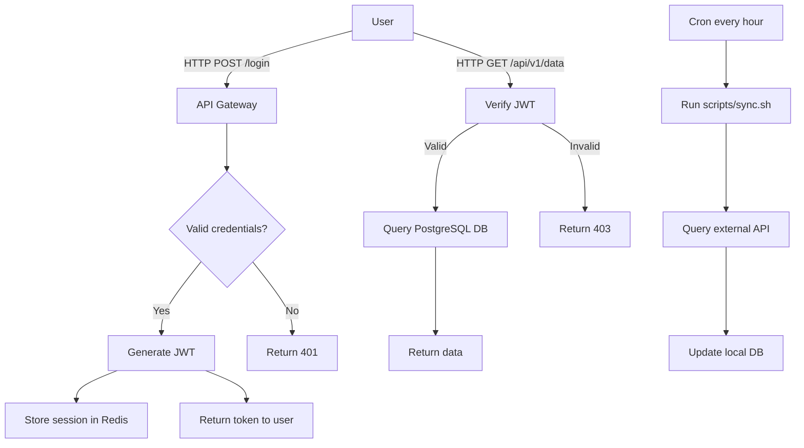
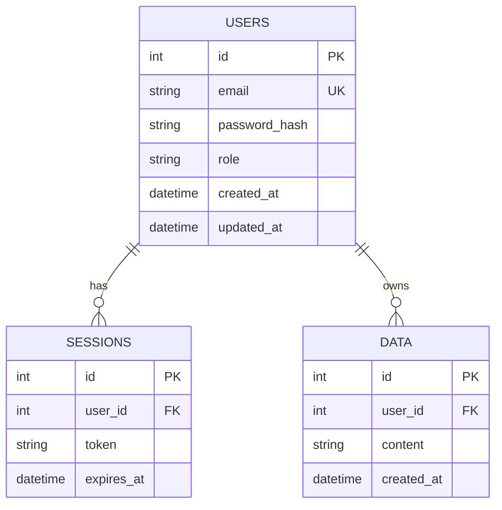

# Forensic Record — [SYSTEM NAME]

🌍 **Read this in:** [Español](../es/REGISTRO_FORENSE.md) | [English](FORENSIC_RECORD.md)

> **Purpose:** This document records what the AI discovered while analyzing a system without documentation.
> It is NOT official documentation; it is the result of reverse engineering.
> If anything here is incorrect, correct it in a new analysis session and update this file.
>
> **Usage:** Any AI working in this repository MUST read this file in full before modifying code.
> If it discovers something new, it MUST add it here with date and finding.

---

## 1. Analysis metadata

| Field | Value |
|-------|-------|
| **Initial analysis date** | [YYYY-MM-DD] |
| **Last update** | [YYYY-MM-DD] |
| **Tool used** | Zoo Code (Architect mode) |
| **Model used** | [DeepSeek V4 Flash / Qwen3 Coder Next / other] |
| **Analyzed code version** | [commit hash or date] |
| **System type** | [web / API / script / desktop / mixed] |
| **Code origin** | [own without docs / third-party / unknown] |
| **Detected license** | [MIT / GPL / proprietary / unknown] |

---

## 2. Module and file inventory

> List all relevant directories and files. The "Confidence" field indicates how sure the AI is of their purpose: High (verified), Medium (inferred), Low (speculation).

| Path | Type | Discovered purpose | Confidence | Notes |
|------|------|--------------------|------------|-------|
| `src/` | Directory | Main source code | High | |
| `src/auth/` | Directory | Authentication and session management | High | Uses JWT |
| `src/models/` | Directory | Data models (ORM) | High | SQLAlchemy |
| `src/api/` | Directory | REST endpoints | High | FastAPI |
| `scripts/backup.sh` | Script | DB backup at 3 AM | Medium | Review retention |
| `scripts/deploy.sh` | Script | Manual deployment to production | Medium | Could be automated |
| `config/db.yml` | Config | DB connection configuration | High | ⚠️ Check whether it contains credentials |
| `config/app.yml` | Config | General configuration | High | |
| `.env` | Config | Environment variables (do not commit) | High | Verify `.gitignore` |
| `tests/` | Directory | Unit and integration tests | Medium | Coverage unknown |
| `docs/` | Directory | Existing documentation | Low | Minimal content |
| `migrations/` | Directory | Database migrations | High | Alembic |

---

## 3. Discovered data flow

> Diagram of the system's main flow. Use Mermaid so VS Code renders it.



---

## 4. Entry points

> Every place where the system receives input from the outside. These are the critical points for security.

| Entry point | Protocol | Port | Authentication | Notes |
|-------------|----------|------|----------------|-------|
| `/api/v1/auth/login` | HTTP | 8000 | No | Receives username/password |
| `/api/v1/auth/register` | HTTP | 8000 | No | Receives user data |
| `/api/v1/data/*` | HTTP | 8000 | JWT | Requires a valid token |
| `/api/v1/admin/*` | HTTP | 8000 | JWT + admin role | Requires elevated role |
| `scripts/sync.sh` | Cron | — | — | Runs every hour |
| `scripts/backup.sh` | Cron | — | — | Runs at 3 AM |
| Database | TCP | 5432 | Username/password | Check whether it listens on 0.0.0.0 |
| Redis | TCP | 6379 | No auth (?) | ⚠️ Check configuration |

---

## 5. Critical external dependencies

> List of dependencies that, if they fail or are compromised, put the system at risk.

| Dependency | Version | Type | Detected risk | Last check |
|------------|---------|------|---------------|------------|
| `fastapi` | 0.115.x | Web framework | No known CVEs | [date] |
| `sqlalchemy` | 2.0.x | ORM | No known CVEs | [date] |
| `psycopg2` | 2.9.x | PostgreSQL driver | Check version | [date] |
| `redis-py` | 5.x | Redis client | No known CVEs | [date] |
| `python-jose` | 3.3.x | JWT | No known CVEs | [date] |
| `passlib` | 1.7.x | Password hashing | No known CVEs | [date] |

**Command to check for vulnerabilities:**
```bash
pip-audit -r requirements.txt
# or
trivy fs --severity CRITICAL,HIGH .
```

---

## 6. Discovered database schema

> Tables, columns and relationships inferred from the code (not from the official schema, which may not exist).



**Notes:**
- No explicit indexes were detected. Check whether production has indexes.
- No explicit foreign keys were detected. Check referential integrity.

---

## 7. Dark zones (NOT understood)

> The AI MUST flag here what it could NOT determine. Future sessions must resolve it.

- [ ] `src/legacy/old_parser.py`: its exact purpose is unclear. It appears to parse a proprietary format.
- [ ] `config/.env.example`: undocumented variables. What does `CUSTOM_API_KEY` do?
- [ ] `scripts/cron.sh`: unclear whether it is still in use or is legacy.
- [ ] `src/utils/helpers.py`: the `_internal_hash()` function has no documentation or tests.
- [ ] `migrations/versions/003_*.py`: migration that drops a table without a documented backup.

---

## 8. Pending verification

> Concrete actions that future sessions must carry out to complete the understanding of the system.

- [ ] Run `npm audit` / `pip-audit` and record findings.
- [ ] Check whether `scripts/backup.sh` has retention configured.
- [ ] Confirm whether there are unauthenticated endpoints (review `src/api/routes/`).
- [ ] Check whether the DB listens on `0.0.0.0` or only on `localhost`.
- [ ] Check for hardcoded secrets (run `gitleaks detect`).
- [ ] Run `semgrep` with OWASP Top 10 rules.
- [ ] Check the Python/Node version and whether it is up to date.
- [ ] Review logs for recurring, undocumented errors.

---

## 9. Preliminary security findings

> What the AI detected as a possible risk during analysis. This is not a full audit; it is a first pass.

| Finding | Severity | Location | Suggested action |
|---------|----------|----------|------------------|
| Possible hardcoded secret | High | `config/db.yml` line 12 | Move to `.env` |
| Endpoint without rate limiting | Medium | `/api/v1/auth/login` | Add middleware |
| Redis without auth | High | `config/app.yml` | Configure `requirepass` |
| Logs with possible PII | Medium | `src/utils/logger.py` | Review what is logged |
| Outdated dependency | Low | `requirements.txt` | Update `psycopg2` |

---

## 10. Update history

| Date | What was updated | Who | Session |
|------|------------------|-----|---------|
| [YYYY-MM-DD] | Complete initial analysis | AI + you | #1 |
| [YYYY-MM-DD] | Dark zone `old_parser.py` resolved | AI + you | #2 |
| [YYYY-MM-DD] | Added Redis security finding | AI | #3 |

---

## 11. Instructions for future AI sessions

> This section is so that any AI reading this file knows how to use it.

**Before modifying code:**
1. Read this file in full.
2. If you are going to modify a module, look up its entry in section 2 (Inventory).
3. If the module is in "Dark zones" (section 7), do NOT modify it without first analyzing it and updating this file.
4. If you discover something new, update the corresponding section with date and finding.
5. If you resolve a pending item (section 8), mark it as completed.

**When you finish your session:**
1. Update section 10 (History) with what you did.
2. If you added new pending items, add them to section 8.
3. If you found new risks, add them to section 9.

---