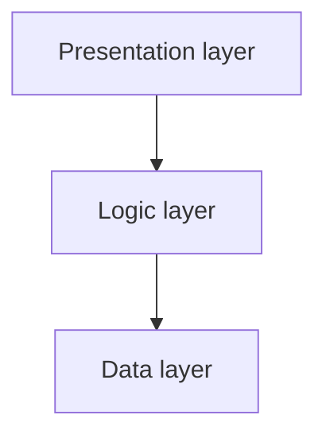
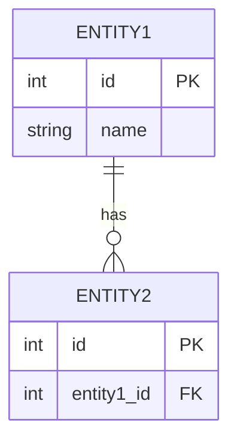
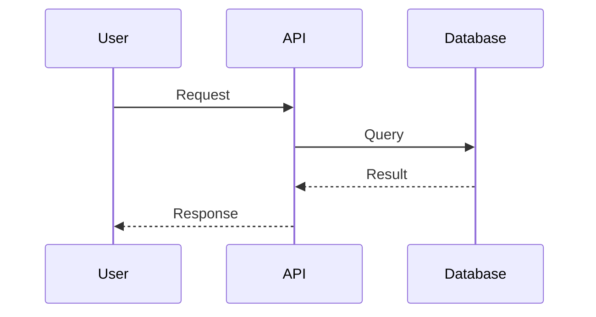

# SSD-TDD — Software Design Document + Technical Design Document

🌍 **Read this in:** [Español](../es/SSD-TDD.md) | [English](SSD-TDD.md)

> **Status:** Pending drafting.
> **Instructions:** Use Prompt 4 (`docs/en/prompts/04-SSD-TDD.md`) with DeepSeek web.
> **Depends on:** `docs/en/SRS.md` + `docs/en/Technical_Proposal.md`
> **Feeds into:** `docs/en/NIST_OWASP_Mapping.md`, `docs/en/Backup_Strategy.md`, `docs/en/Test_Plan.md`

---

## 1. Detailed architecture

### 1.1. Component diagram



### 1.2. Application layers
- **Presentation:** [Description]
- **Business logic:** [Description]
- **Data access:** [Description]

### 1.3. Applied design patterns
| Pattern | Where it is applied | Rationale |
|---------|---------------------|-----------|
| [Pattern] | [Module] | [Why] |

## 2. Database design

### 2.1. Entity-Relationship diagram



### 2.2. Tables

#### Table: `[name]`
| Column | Type | Constraints | Description |
|--------|------|-------------|-------------|
| id | INTEGER | PK, AUTO | Identifier |
| [column] | [type] | [constraints] | [description] |

### 2.3. Indexes
| Table | Columns | Type | Rationale |
|-------|---------|------|-----------|
| [table] | [columns] | [BTREE/HASH] | [Why] |

### 2.4. Migration strategy
- **Tool:** [Alembic, Flyway, Knex, etc.]
- **Naming convention:** [e.g. `YYYYMMDD_description`]

## 3. API design

### 3.1. Endpoints
| Method | Path | Description | Auth |
|--------|------|-------------|------|
| GET | `/api/v1/[resource]` | [Description] | [Yes/No] |

### 3.2. Example contract

**Request:**
```json
{
  "field": "value"
}
```

**Response (200):**
```json
{
  "field": "value"
}
```

**Response (400):**
```json
{
  "error": "message"
}
```

### 3.3. Error codes
| Code | Meaning |
|------|---------|
| 400 | Bad Request |
| 401 | Unauthorized |
| 403 | Forbidden |
| 404 | Not Found |
| 500 | Internal Server Error |

## 4. Sequence diagrams

### Flow: [Flow name]



## 5. Security decisions in the design

- **Authentication:** [JWT, OAuth2, sessions]
- **Authorization:** [RBAC, ABAC, ACL]
- **Encryption in transit:** [TLS 1.3]
- **Encryption at rest:** [AES-256]
- **Secrets management:** [.env, vault, KMS]
- **Input validation:** [Sanitization, whitelisting]
- **Secure logging:** [What NOT to log]

## 6. Testing strategy (summary)

> **Note:** This section is a **summary**. Full details are in `docs/en/Test_Plan.md`. If there is a discrepancy, `Test_Plan.md` takes precedence.

- **Unit:** [target %] — [Tool]
- **Integration:** [target %] — [Tool]
- **E2E:** [target %] — [Tool]
- **Minimum coverage:** [%]
