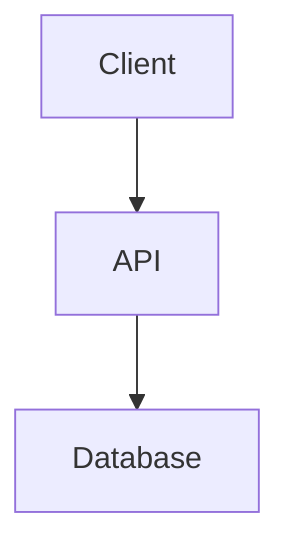

# Technical Proposal

🌍 **Read this in:** [Español](../es/Propuesta_Tecnica.md) | [English](Technical_Proposal.md)

> **Status:** Pending drafting.
> **Instructions:** Use Prompt 3 (`docs/en/prompts/03-Technical-Proposal.md`) with DeepSeek web or Gemini web.
> **Depends on:** `docs/en/SRS.md`
> **Feeds into:** `docs/en/SSD-TDD.md`

---

## 1. Technology stack

### 1.1. Programming language(s)
- **Primary language:** [Language and version]
- **Rationale:** [Why it was chosen]
- **Rejected alternatives:** [And why]

### 1.2. Backend framework(s)
- **Framework:** [Name and version]
- **Rationale:** [Why it was chosen]

### 1.3. Frontend framework(s)
- **Framework:** [Name and version, if applicable]
- **Rationale:** [Why it was chosen]

### 1.4. Database
- **Engine:** [PostgreSQL, MySQL, SQLite, etc.]
- **Rationale:** [Why it was chosen]

### 1.5. Infrastructure
- **Deployment:** [Local, containers, cloud]
- **Rationale:** [Why it was chosen]

## 2. High-level architecture

[Description of components and data flow.]

## 3. Deployment strategy

### 3.1. Development
[Pending: how it is deployed in development.]

### 3.2. Production
[Pending: how it is deployed in production.]

### 3.3. Rollback
[Pending: how to revert a deployment.]

## 4. Licensing strategy

- **Chosen model:** [100% free / 100% proprietary / community + paid version]
- **Recommended license:** [MIT, GPL-3.0, Apache 2.0, proprietary]
- **Dependency compatibility:** [License verification]

## 5. Technical risks and mitigations

| ID | Risk | Probability | Impact | Mitigation |
|----|------|-------------|--------|------------|
| TR-001 | [Risk] | [High/Medium/Low] | [High/Medium/Low] | [Mitigation] |
